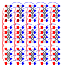

# Plotting

Plotting packages in Julia

* Compose

It is a pacakge for declarative vector graphs. For example, the following chimera lattice is plotted with [Viznet](https://github.com/GiggleLiu/Viznet.jl), which is a lattice extension of Compose.

* GR
* Gadfly
* Luxor
* Makie
* PlotlyJS
* Plots
* PyPlot
* UnicodePlots

You will never see a plotting package that can plot in terminal in Matlab

* VegaLite

## Gripes

#### The first plot issue

Ubuntu 18.04, Julia 1.4 

CPU: Intel(R) Core(TM) i5-7200U CPU @ 2.50GHz

| Package | Version | using | first call |
| ----- | ----- | ----- | ----- |
| Compose | 0.8.2 | 2.470858686 | 6.7988035 |
| GR | 0.48.0 | 0.25929856 | 5.163709237 |
| Gadfly | 1.2.1 | 14.95206782 | 54.382019271 |
| Luxor | 1.7.0 | 7.615935311 | 1.044750751 |
| Makie | 0.10.0 | 25.349458292 | 65.66177748 |
| PlotlyJS | 0.13.1 | 9.710053508 | 22.154461408 |
| Plots | 1.2.0 | 12.681149359 | 18.526376828 |
| PyPlot | 2.9.0 | 5.735066296 | 1.062290351 |
| UnicodePlots | 1.2.0 | 0.67672249 | 1.636349814 |
| VegaLite | 2.1.3 | 7.53092304 | 4.415782982 |

However, these issues will eased in next Julia releases.
[cite issues]
